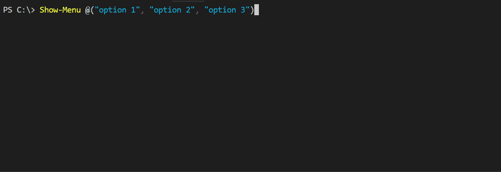
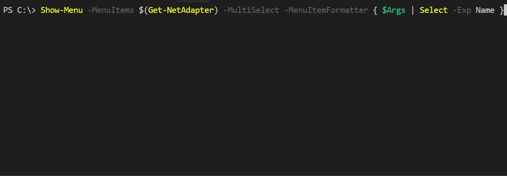
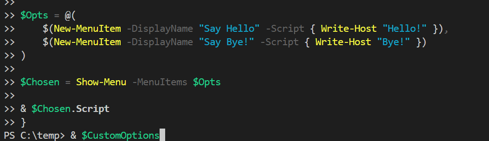
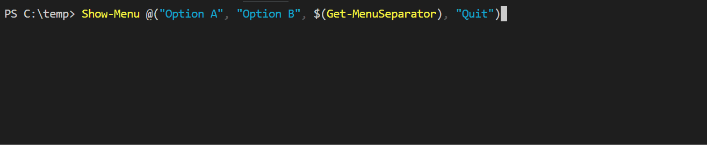

# PSMenu

Simple module to generate interactive console menus (like yeoman)

# Examples

Very basic example.

```powershell
Show-Menu @("option 1", "option 2", "option 3")
```



## Custom formatting

Custom formatting of menu items and multi-selection:

```powershell
Show-Menu -MenuItems $(Get-NetAdapter) -MultiSelect -MenuItemFormatter { $Args | Select -Exp Name }
```



## Custom options

You can also use custom options (enriched options). A more complicated example:

```powershell
class MyMenuOption {
    [String]$DisplayName
    [ScriptBlock]$Script

    [String]ToString() {
        Return $This.DisplayName
    }
}

function New-MenuItem([String]$DisplayName, [ScriptBlock]$Script) {
    $MenuItem = [MyMenuOption]::new()
    $MenuItem.DisplayName = $DisplayName
    $MenuItem.Script = $Script
    Return $MenuItem
}

$Opts = @(
    $(New-MenuItem -DisplayName "Say Hello" -Script { Write-Host "Hello!" }),
    $(New-MenuItem -DisplayName "Say Bye!" -Script { Write-Host "Bye!" })
)

$Chosen = Show-Menu -MenuItems $Opts

& $Chosen.Script
```

This will show the menu items like you expect.



## Separators

```powershell
Show-Menu @("Option A", "Option B", $(Get-MenuSeparator), "Quit")
```

Separators are unselectable items used for visual distinction in the menu.



## Callback

The Callback option can be used to perform actions while the menu is displayed.
Note: always save & restore the cursor position like in the following example if the host output is changed in the callback.

```powershell
Clear-Host
Write-Host "Current time: $(Get-Date)"
Write-Host ""
Show-Menu @("Option A", "Option B") -Callback {
    $lastTop = [Console]::CursorTop
    [System.Console]::SetCursorPosition(0, 0)
    Write-Host "Current time: $(Get-Date)"
    [System.Console]::SetCursorPosition(0, $lastTop)
}
```


# Installation

You can install it from the PowerShellGallery using PowerShellGet

```powershell
Install-Module PSMenu
```

# Features

- Returns value of selected menu item
- Returns index of selected menu item (using `-ReturnIndex` switch)
- Multi-selection support (using `-MultiSelect` switch), use `spacebar` to select items
- Navigation with `up/down/page-up/page-down/home/end` keys
- Longer list scroll within window
- Support for separators
- Esc key quits the menu (`$null` returned)
- Extensively documented
- Perform actions while the menu is displayed (using `-Callback`)

# Documentation

For details, check out the comment-based help in [the source code](./PSMenu/Public/Show-Menu.ps1),
or use `Get-Help Show-Menu` from the command-line. See also [`Get-Help`](https://docs.microsoft.com/en-us/powershell/module/microsoft.powershell.core/get-help?view=powershell-5.1).

# Contributing

- Source hosted at [GitHub](https://github.com/Sebazzz/PSMenu)
- Report issues/questions/feature requests on [GitHub Issues](https://github.com/Sebazzz/PSMenu/issues)

Pull requests are very welcome!
